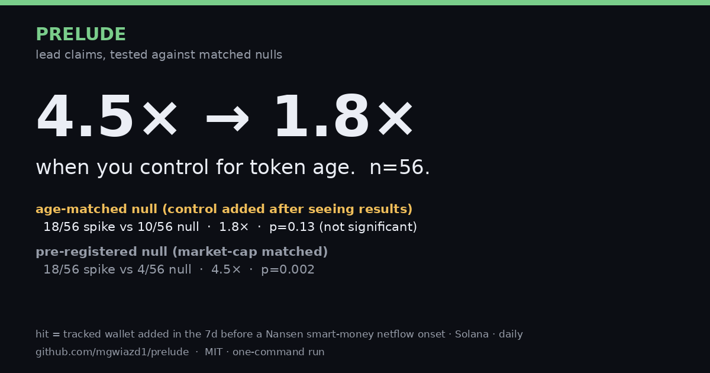

# Prelude

Built on the Nansen API for the Nansen Meridian Buildathon (Sep 14–27, 2026).



**Do operator wallets enter tokens before smart money piles in?**

Prelude tracks a private roster of operator wallets through the Nansen API, and
tests every "they got in early" claim against a matched null. The first claim
we put through it was our own, and it didn't survive the null:

| Null control | Spike hits | Null hits | Lift | p (Fisher) |
|---|---|---|---|---|
| **Age-matched** (control added after seeing results) | 18/56 | 10/56 | **1.8×** | 0.13, not significant |
| Market-cap matched (pre-registered) | 18/56 | 4/56 | 4.5× | 0.002 |

**4.5× → 1.8× when you control for token age. n=56.** Most of the apparent
lead is a young-token effect: the roster buys young tokens, and young tokens
are where smart-money onsets happen. The remaining gap is concentrated in
two wallets. Without them, the age-matched lift is 1.0× (8/56 vs 8/56). That
is a statement about concentration only. Per-wallet n is tiny and the check
was also chosen after seeing results, so it says nothing about skill.

That's the product: **Prelude measures lead claims against matched nulls and
shows which ones survive.**

## Quick start

1. **Demo: no API key, no network. This is the judge path.**
   ```bash
   pip install -r requirements.txt
   make demo
   ```
   Runs the pipeline (snapshot → diff → classify → score → receipt card) on
   **synthetic** fixtures in `data/fixtures/` with synthetic wallets. It shows
   how the pipeline works, not a result.

2. **Live mode** (needs a Nansen API key):
   ```bash
   PRELUDE_NANSEN_KEY=… make run
   ```
   Makes one balance-snapshot pass. With no private roster present it polls
   the example roster (`data/roster.example.json`: public exchange and
   public-figure addresses).

3. **Tests** (44, no network): `make test`

4. **The backtest table** from the committed results (no key):
   `python3 -m prelude backtest-table`

## Why the roster is private

The roster isn't claimed to have an edge; the headline above says it mostly
doesn't. It is private because operator attribution is private research.
Publishing it would identify individual wallets, using attribution data we
can't redistribute.

So all public output (`check`, the recording, this README, the receipt card)
is **redacted**:
- Wallets appear as stable pseudonyms (`Wallet A`, `Wallet B`, …), with the
  mapping kept privately. Wallet names count as addresses, because SNS names
  (`x.sol`) resolve to addresses.
- `check` also coarsens per-wallet dates to ISO weeks and sizes to bands. A
  pseudonym plus an exact day and amount could be matched to on-chain buyers.
- The published backtest file (`results/onset_backtest.public.json`) carries
  per-window **hit counts** only, never which wallet.

## How it works

**The wallet spine.** 45 active Solana wallets are polled every 3h with
`profiler/address/current-balance` (1 credit per wallet). Entry history comes
from a 90-day backfill via `profiler/address/historical-balances` (full
balances, daily resolution, 87 credits). 41 of the 45 wallets have history;
4 returned none. Entry times always come from the backfill, never from
snapshot order. Snapshot order only tells you when our poller started.

**`check <token>`** reads stored data only (0 API calls) and answers "did the
signal wallets enter before the rest of the tracked roster?". Verdicts:
`SIGNAL_LEAD` / `COHORT_LEAD` / `CONCURRENT` / `SIGNAL_ONLY` / `COHORT_ONLY` /
`UNVERIFIED_ENTRY_TIMING` (entry order can't be established: snapshot-only
entry, or both sides already held when history begins).
Every verdict prints:
- a provenance line, because a lead claim is only valid when both entry times
  come from the backfill;
- the entry size and a size floor (sub-$1k / $1k / $5k);
- n.

The "cohort" is our own tracked wallets, not the public.
```bash
python3 -m prelude check <symbol-or-address>        # redacted by default
```

**Nansen endpoints used** (credits per call; costs are confirmed from the
`X-Nansen-Credits-Cost` header or the credit balance):

| Endpoint | Used for | Credits |
|---|---|---|
| `POST /api/v1/profiler/address/current-balance` | 3h live snapshot, per wallet | 1 |
| `POST /api/v1/profiler/address/historical-balances` | 90-day entry-history backfill | 1 per page |
| `POST /api/v1beta1/token-screener/historical` (`trader_type=sm`) | daily smart-money netflow: the backtest onset clock | 5 |
| `POST /api/v1/profiler/address/transactions` | roster screening (activity in the last 30 days) | 1 |
| `POST /api/v1/profiler/address/related-wallets` | roster expansion candidates (human-approved) | 1 |
| `POST /api/v1/profiler/address/labels` | checking the public example addresses | ~127 |
| `POST /api/v1/tgm/token-ohlcv` | request shape verified (10 tokens per call); not used in the results | 1 |

We probed these during design and didn't use them: `tgm/flows`,
`tgm/flow-intelligence`, `smart-money/netflow`, `tgm/who-bought-sold`, and
`v1beta1/tgm/historical-who-bought-sold`.

**The backtest** (`prelude/onset.py`, parameters fixed in its docstring
before the first run):

- **Onset:** the first day a token's Nansen smart-money netflow reaches
  ≥ $10k, after 7 days summing to < $5k. Source:
  `token-screener/historical`, `trader_type=sm`, one call per day. Solana,
  market cap $100k–$25M, token age ≥ 8d, onsets from Jul 3 to Sep 15 2026.
  This is a **disclosed proxy** for "the crowd starts to care".
- **Hit:** any roster wallet whose **token amount** rose in the 7 days before
  the onset. Hits are read from stored `balance_history`, at zero API cost.
  We use amount, not USD, because USD moves with price.
- **Null:** for each spike, a quiet token on the same day (no ≥ $10k
  smart-money day within ±7d), matched on market cap (pre-registered), with
  the same window and the same hit rule.
- **n at each stage:** 89 screener days → 850 candidate tokens → 56 onsets →
  56 matched pairs.
- **Reproduce:** `onset-plan` (0 credits) → `onset-fetch` → `onset-run`.
  `onset-run` writes the full result locally and the redacted copy to
  `results/`.

**Median lead: 120h (IQR 72–162h, n=18).** Hits are spread across the whole
7-day window, so this number is set by the window. It says nothing about
timing precision.

**Dropped hypothesis: "operators probe small, then size up."** We tested it
on token amounts:
- Only 1 small signal entry fell inside a spike window, and 0 inside nulls,
  so the spike-vs-null version can't be answered.
- Unconditionally, signal wallets' small first entries scaled ≥ 2× within
  14 days at the same rate as the rest of the roster (21%, n=66, vs 23%,
  n=292).

So we dropped it.

## Why not Smart Alerts?

Smart Alerts pushes a notification when a threshold is crossed, so a slow,
sub-σ build-up never fires. It also exposes no queryable history of past
triggers, and a backtest needs one. Prelude reads balances directly, stores
them locally, and can re-test any claim against its own history.

## Chain-horizon principle (roadmap)

The same wallet spine runs on a different clock per chain:
- **Solana** tokens run fast and burn out. The question there is stealth
  leads: were operators in before smart money? That's the chain tested here.
- **Base and Robinhood Chain** cook slowly and run harder. The question there
  is maturation: do operators hold through the build? That's on the roadmap
  and not tested in this repo.

## Budget design

- **Metering:** every Nansen call is logged to an `api_usage` table under a
  gate-scoped caller: `prelude` (poller), `prelude_backtest`, `prelude_pin`.
  The client reads each response's `X-Nansen-Credits-Cost` header, so a
  wrong cost-table entry shows up on the first call.
- **Poller gates:** 1,500 calls/day and 8,000 per 7 days. Credit floors: below
  5,000, flow-intelligence drops to 12h; below 2,000, balances only. The last
  1,000 credits are held as a demo reserve.
- **The backtest reuses stored balances.** Hits cost nothing; the only spend
  is the daily screener enumeration (5 credits per day).
- **Two findings about the Nansen API:**
  - `token-screener/historical` ignores `pagination.page`. It returns page 1
    with `is_last_page=false` forever, so we use `per_page=1000`, and a page
    with no new tokens stops the loop.
  - The smart-money netflow is only smart money with `trader_type=sm`. The
    default is all traders.

## Limits

- **Controlling for token age removes most of the gap**, as reported above:
  1.8×, not significant. The age control was added after seeing results. The
  pre-registered 4.5× is shown beside it, not instead of it.
- **n=56 pairs, short of the 100 we targeted.** The onset rule is strict, and
  we didn't loosen it to reach the target.
- **Daily resolution.** The minimum resolvable lead in the backtest is 24h. The
  live poller runs every 3h, so the minimum resolvable live lead is 3h.
- **Onset proxy.** Smart-money netflow stands in for a narrative onset. It is
  not the narrative.
- **Soft USD sizes for micro-caps.** `historical-balances` USD values
  disagreed with the OHLCV close by about 2.8× on a spot-checked day. Entry
  sizes, and the $1k floor, are approximate. Hits use token amounts for this
  reason.
- **Look-ahead in segment labels.** Today's Nansen smart-money labels applied
  to past days is selection on outcome: a wallet can be labelled smart money
  *because* it was early.
- **The roster follows as often as it leads.** Across 90 days, deduped by
  token address, `check` gives **22 signal-first / 36 cohort-first / 12
  concurrent** (as of Sep 23; the live poller adds data). None of the 22
  signal-first entries was ≥ $1k. Nothing here means "these wallets
  habitually lead".
- **Left-censoring.** History starts Jun 25. A position already held that day
  has an unknown entry date. If one side is censored, `check` prints the lead
  as a minimum (`>=`). If both are, it refuses to order them
  (`UNVERIFIED_ENTRY_TIMING`). The backtest starts onsets on Jul 3 for the same
  reason.
- **12h alert threshold.** This is deliberate conservatism, not a resolution
  limit.
- **Missing history.** 4 of the 45 polled wallets returned no history, so
  they can't pull a cohort entry earlier.

## Quota evidence (Nansen buildathon: ≥ 1,000 calls, Sep 14–27)

```sql
-- all Nansen calls on the key
SELECT COUNT(*) FROM api_usage WHERE service='nansen' AND called_at >= '2026-09-14';
-- Prelude's own (FlowPulse was its working name on Sep 22)
SELECT COUNT(*) FROM api_usage WHERE service='nansen' AND called_at >= '2026-09-14'
  AND (caller LIKE 'prelude%' OR caller LIKE 'flowpulse%');
```

`api_usage` **understates** Nansen's own count. Some early probe calls went
outside the metered client and were never logged. Credit costs for
`profiler/address/labels` were also under-recorded until the cost table was
corrected on Sep 23.

## License

MIT, see `LICENSE`.
